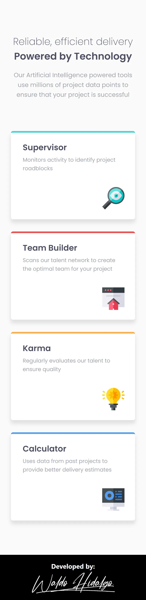
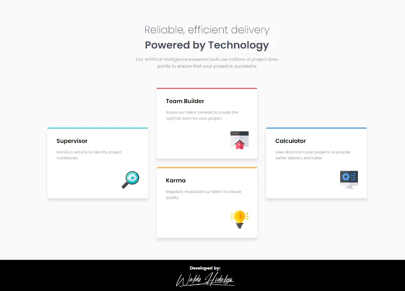
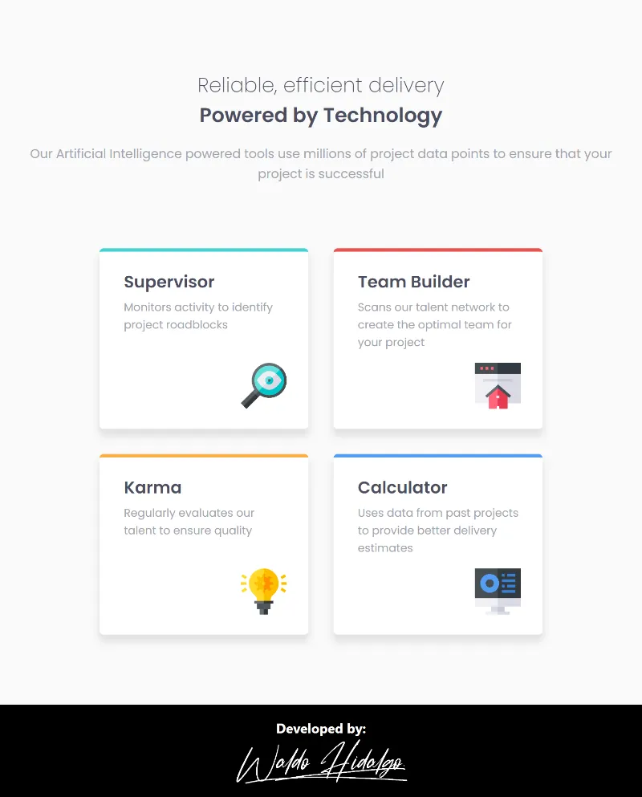

# Four card feature section

Repositorio con el código solución del challenge: [Four card feature section challenge on Frontend Mentor](https://www.frontendmentor.io/challenges/four-card-feature-section-weK1eFYK)

## Tabla de Contenidos

- [Four card feature section](#four-card-feature-section)
  - [Tabla de Contenidos](#tabla-de-contenidos)
  - [The challenge](#the-challenge)
  - [Diseños a Replicar](#diseños-a-replicar)
    - [1-Mobile Design](#1-mobile-design)
    - [2-Desktop Design](#2-desktop-design)
  - [Proyecto Realizado](#proyecto-realizado)
    - [1-Mobile Size](#1-mobile-size)
    - [2-Desktop Size](#2-desktop-size)
    - [3-Tablet Size](#3-tablet-size)

## The challenge

El desafío consiste en realizar lo siguiente:

> Users should be able to:
>
> - View the optimal layout for the site depending on their device's screen size

## Diseños a Replicar

### 1-Mobile Design

### 2-Desktop Design

## Proyecto Realizado

### 1-Mobile Size

### 2-Desktop Size

### 3-Tablet Size

