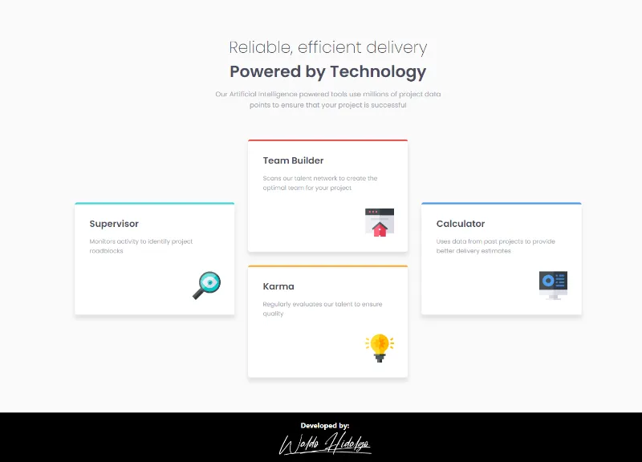

# Four card feature section

Repositorio con el código solución del challenge: [Four card feature section challenge on Frontend Mentor](https://www.frontendmentor.io/challenges/four-card-feature-section-weK1eFYK)

## The challenge

El desafío consiste en realizar lo siguiente:

> Users should be able to:
>
> - View the optimal layout for the site depending on their device's screen size

## Diseños a Replicar

### 1-Mobile Design

### 2-Desktop Design

## Proyecto Realizado

### 1-Mobile Size

### 2-Desktop Size

### 3-Tablet Size

